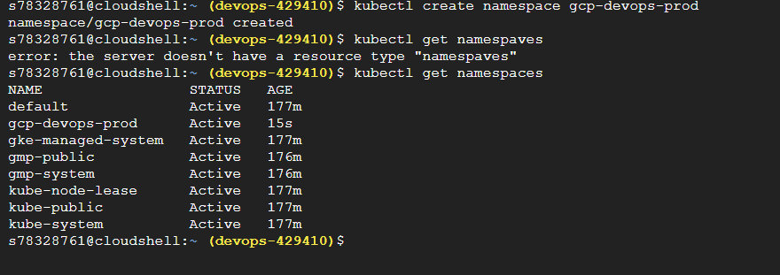
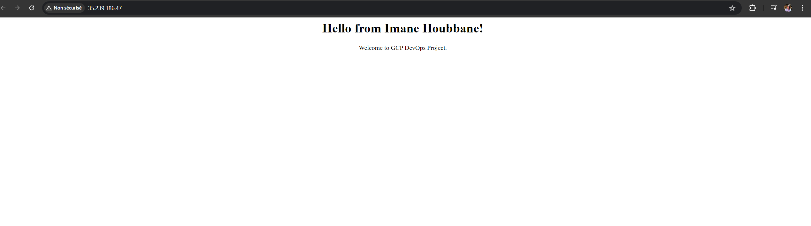

# GCP DevOps Project
## Sprint 01: Initial Setup and Simple Docker Integration

### Overview
This document outlines the steps to create a new GitHub repository, set up the repository according to company best practices, implement branch protection, write a simple Docker image, test the code locally, and push the code to the GitHub repository.

### 1. Creating a New GitHub Repository
- Navigate to [GitHub](https://github.com/) and sign in.
- Click on the "+" icon in the upper right corner and select **New repository**.
- Name your repository `GCP_DevOps_Project`.
- Choose the visibility (public or private).
- Initialize the repository with a README if required.

### 2. Setting Up the Repository According to Company Best Practices
- **Add `.gitignore`**: Create a `.gitignore` file suitable for Python/Node.js or any other stack you are using.
- **License**: Add a `LICENSE` file according to the company's policy on open source contributions.
- **Contribution Guidelines**: Include a `CONTRIBUTING.md` file to guide other developers on how to contribute to the repository.

### 3. Branch Protection
- Go to the repository settings on GitHub.
- Under the **Branches** section, click on **Add rule**.
- Enter `main` in the branch name pattern.
- Check the following options:
  - **Require pull request reviews before merging**: Choose how many reviewers are required.
  - **Require status checks to pass before merging**: Enable status checks if necessary.
  - **Include administrators**: Enforce all configured restrictions for administrators.
  - **Restrict who can push to matching branches**: Optionally, set who can push to the main branch.

### 4. Writing a Simple Docker Image
- Create a `Dockerfile` in the root of your project

## Sprint 02: Create GKE cluster
### 1. Creating GCP account
Create GCP account by visiting this URL : console.cloud.google.com 

### 2. Setting up budget and alerting

### 3. Setting up GKE cluster
Create Kubernetes cluster by specifying some parameters like cluster name.

## Sprint 03: Design discussion
### 1. Connecting Github repo and Cloud Build
Connect Github repo and Cloud Build using Cloud Build Trigger and specifying cloudbuild.yaml file as configuration file 

### 2. Create cloudbuild.yaml file
Contains automating building of image based on event like push to the master/main branch.

## Sprint 04: Application of design discussion
### 1. Connecting Github repo and Cloud Build

### 2. Create cloudbuild.yaml file

## Sprint 05: Deployment in K8s
### 1. Create namespace in GKE cluster
Using the command : kubectl create namespace gcp-devops-prod to create namespace for our project.
We can list then namespaces using : kubectl get namespaces

### 2. Create deployment file

### 3. Update cloudbuild file
Use deployment file in cloudbuild file to deploy the image created in steps before.

## Sprint 06: Expose application to the external users
### Add service to deployment_gke file to expose application on port 80

Finally, remember to delete resources if you are finished with them
